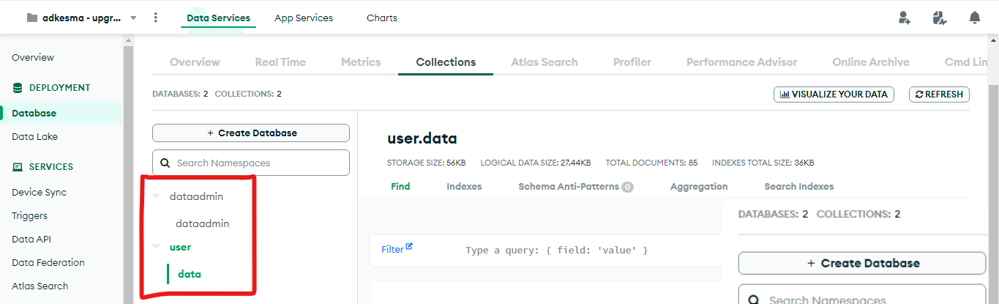
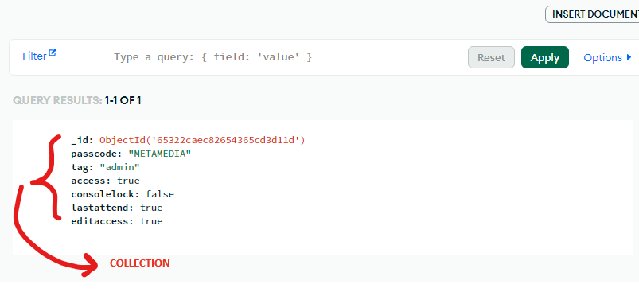
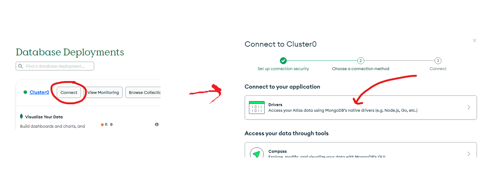
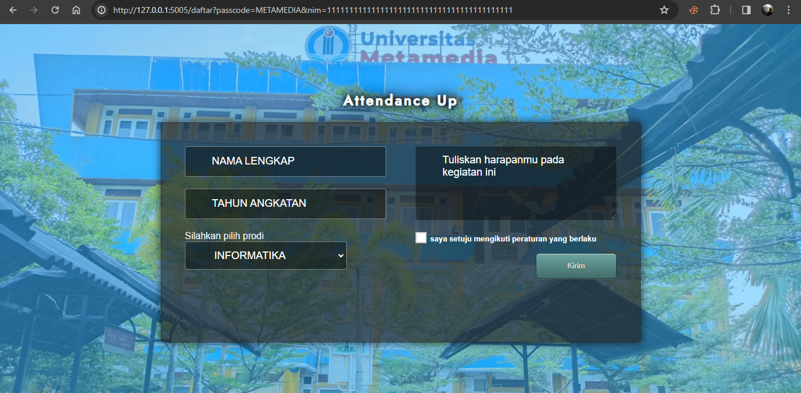
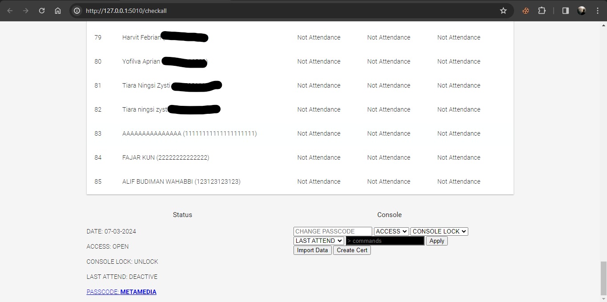

# UPGRADING-STUDENT-LIVE-ABSENT

Our Activity Record on Instagram. [click here to view](https://www.instagram.com/p/Cy7eT_XpZuo/?igsh=MWw5MHViZTFyMWluZQ==)

# DOKUMENTASI DALAM BAHASA INDONESIA:

[Dokumentasi Bahasa Indonesia](readme\indonesia\README.md)

# ENGLISH DOCUMENTATION:

This repository serves as an example of using Python 3 programming language with Flask framework and other additional modules, as well as MongoDB as the database to create a live attendance website for the event "Upgrading Student" organized by the Student Executive Board at my campus. This website is designed to allow event participants to check in and view live reports.

In this repository, you will find:

1. **Python Code using Flask**: Backend website code written in Python programming language using Flask framework. This includes logic to manage participant attendance, retrieve data from MongoDB database, and present it in a suitable format for display on the frontend.

2. **Additional Modules**: Usage of additional Python modules for specific purposes, such as modules to access MongoDB, user session management, and possibly other modules required for specific functions.

3. **MongoDB as Database**: Usage of MongoDB as the database to store event participant attendance data. This includes database schema, queries to add, retrieve, or update data, and MongoDB integration with Flask application.

4. **Frontend and Live Report**: Frontend website views allowing event participants to check in and view attendance reports live. This may include web pages for attendance input, automatically updated live report views, and appropriate user interface design.

By using a combination of Python 3, Flask, MongoDB, and additional modules, this repository provides a solid foundation for creating an interactive and user-friendly live attendance website for the "Upgrading Student" event.

This program is created with the aim of simplifying the attendance process, which was previously done manually. Additionally, this program enables easy, fast, and accurate monitoring of event attendees.

One of the advantages of this program is its ability to export data stored in the database (MongoDB Cloud Database) to Excel format, making it easier to process participant attendance data.

Several features have been implemented to enhance the reliability of this attendance program, including:

### Passcode Feature

This feature requires each participant to enter a passcode to check in. Passcodes can be changed via the admin console.

### Absence Lock

This feature allows users to lock attendance so that participants cannot check in. This feature can be set via the admin console.

### Last Attendant

Last Attendant is a feature that, when activated, switches attendance to last attendance mode. This function is intended so that participants who did not attend the first and second days cannot check in on the last day.

### Console Lock

This program is equipped with settings using commands accessible via the console available on the admin panel.

Some functions accessible via the console include:
- Delete data based on ID => /del id_number
- Update name based on ID => /upname id_number|new_name
- Update student ID based on ID => /upnim id_number|new_id_number
- Spam the database => /spam total_spam
- Delete all data in the database => /clear all data
- Ping pong => /ping

### Automatic Certificate Generation Feature Based on Database

This program is also capable of automatically generating certificates using information stored in the database.

# SETUP MONGODB DATABASE

First, create a database in MongoDB, create 2 database names, and 2 collection names.

_*Group A*_

1. Database name: dataadmin
2. Collection name: dataadmin

_*Group B*_

1. Database name: user
2. Collection name: data

Here's the schema:
```
- Cluster0 (MongoDB Cluster)
    ↳ dataadmin
        ↳ dataadmin
    ↳ user
        ↳ data
```


Create a BSON (collection) in the dataadmin/dataadmin section with keys and values as shown below using insert document.



# SETUP CONFIG.JSON

Find the config.json file, input the MongoDB URL for driver access into the key `"mongo_client"`
```json
{
    "mongo_client":"MONGODB DRIVER URL"
}
```
Get the MongoDB driver access URL here:



# DATE SETTING 
Set 3 dates ahead (2 dates for day 1 and 2, and 1 date in the last attendance format for day 3) in admin.py

Example:
```PY
# add attenden day 1, day 2 and last attenden
date_attend = ("03-03-2024", "04-03-2024","05-03-2024(last attend)")
```

# RUN

To run live absent
```
python3 app.py
```

To run admin console
```
python3 admin.py
```

# PROGRAM PREVIEW

## LIVE ABSENT




## ADMIN CONSOLE

