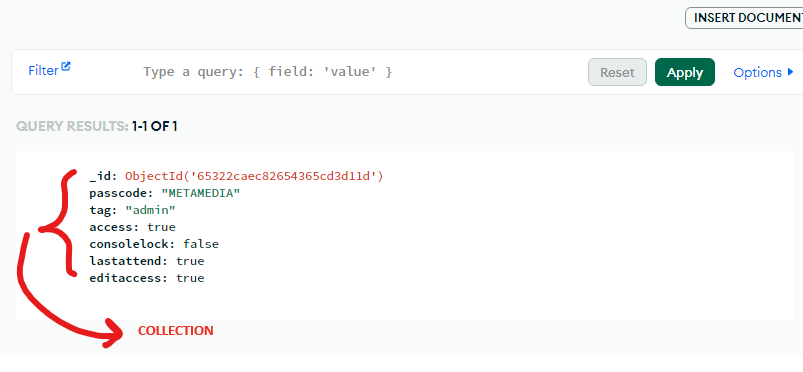
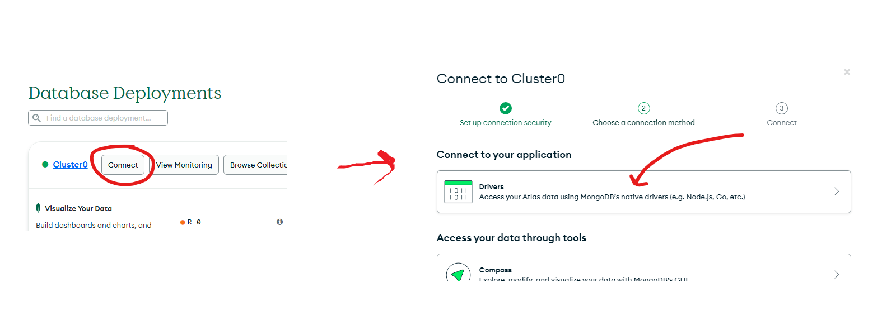
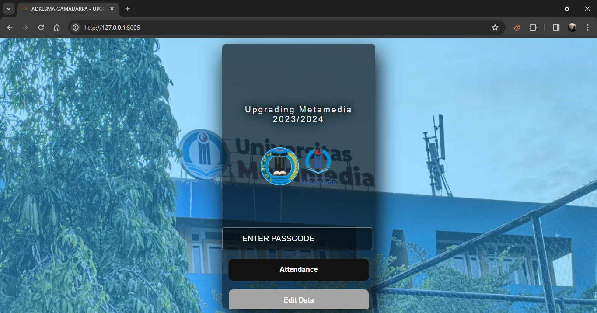
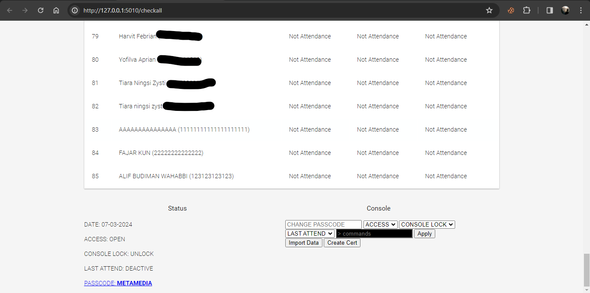

# UPGRADING-MAHASISWA-LIVE-ABSENT

Repository ini adalah contoh penggunaan bahasa pemrograman Python 3 dengan Framework Flask dan modul-modul tambahan lainnya, serta MongoDB sebagai database untuk membuat sebuah website live absensi untuk acara "Upgrading Mahasiswa" yang diselenggarakan oleh Badan Eksekutif Mahasiswa di kampus saya. Website ini dirancang untuk memungkinkan peserta acara melakukan absensi dan melihat laporan langsung secara live.

Dalam repository ini, Anda akan menemukan:

1. **Kode Python menggunakan Flask**: Kode backend website yang ditulis dalam bahasa pemrograman Python menggunakan framework Flask. Ini mencakup logika untuk mengelola absensi peserta, mengambil data dari database MongoDB, dan menyajikannya dalam format yang sesuai untuk ditampilkan di frontend.

2. **Modul-modul Tambahan**: Penggunaan modul-modul tambahan Python untuk keperluan tertentu, seperti modul untuk mengakses MongoDB, manajemen session pengguna, dan mungkin modul-modul lain yang diperlukan untuk fungsi khusus.

3. **MongoDB sebagai Database**: Penggunaan MongoDB sebagai database untuk menyimpan data absensi peserta acara. Ini termasuk skema database, kueri untuk menambahkan, mengambil, atau memperbarui data, serta integrasi MongoDB dengan aplikasi Flask.

4. **Frontend dan Live Report**: Tampilan frontend website yang memungkinkan peserta acara untuk melakukan absensi dan melihat laporan absensi secara langsung. Ini mungkin termasuk halaman web untuk input absensi, tampilan live report yang diperbarui secara otomatis, dan desain antarmuka pengguna yang sesuai.

Dengan menggunakan kombinasi Python 3, Flask, MongoDB, dan modul-modul tambahan, repository ini menyediakan landasan yang solid untuk membuat website live absensi yang interaktif dan mudah digunakan untuk acara "Upgrading Mahasiswa".

Program ini dibuat dengan tujuan untuk mempermudah proses absensi yang sebelumnya harus dilakukan secara manual. Selain itu, program ini juga memungkinkan pemantauan peserta yang hadir pada acara dengan cara yang mudah, cepat, dan akurat.

Salah satu keunggulan program ini adalah kemampuannya untuk mengekspor data yang tersimpan dalam database (Cloud Database MongoDB) ke dalam format Excel, sehingga memudahkan dalam pengolahan data absensi peserta.

Terdapat beberapa fitur yang telah diimplementasikan untuk meningkatkan keandalan program absensi ini, di antaranya adalah:

### Fitur Passcode

Fitur ini diciptakan agar setiap peserta harus memasukkan passcode untuk melakukan absensi. Passcode dapat diubah melalui console admin.

### Lock Absent

Fitur ini memungkinkan pengguna untuk mengunci absensi sehingga peserta tidak dapat melakukan absensi. Fitur ini dapat diatur melalui console admin.

### Last Attendant

Last Attendant adalah fitur yang, ketika diaktifkan, akan membuat absensi berubah menjadi mode absen terakhir. Fungsi ini dituju agar peserta yang tidak mengikuti hari pertama dan kedua tidak dapat melakukan absensi di hari terakhir.

### Console Lock

Program ini dilengkapi dengan pengaturan menggunakan perintah yang dapat diakses melalui console yang tersedia pada panel admin.

Beberapa fungsi yang dapat diakses melalui console adalah sebagai berikut:
- Hapus data berdasarkan ID => /del id_number
- Perbarui nama berdasarkan ID => /upname id_number|nama_baru
- Perbarui NIM berdasarkan ID => /upnim id_number|new_id_number
- Kirim spam ke database => /spam total_spam
- Menghapus semua data dalam database => /clear all data
- Ping pong => /ping

### Fitur Pembuatan Sertifikat Secara Otomatis Berdasarkan Database

Program ini juga mampu membuat sertifikat secara otomatis dengan menggunakan informasi yang tersimpan dalam database.

# SETUP DATABASE MONGODB

pertama-tama, buat database di mongodb, buat database 2 database name, dan 2 collection name

_*Group A*_

    1. database name: dataadmin
    2. collection name: dataadmin

_*Group B*_

    1. database name: user
    2. collection name: data

Berikut skemanya:
```
- Cluster0 (MongoDB Cluster)
    ↳ dataadmin
        ↳ dataadmin
    ↳ user
        ↳ data
```


pada bagian dataadmin/dataadmin. buat sebuah bson (collection) dengan key dan value seperti di bawah ini menggunakan insert document.



# SETUP CONFIG.JSON

temukan file config.json, masukan mongodb url untuk drive accesss ke dalam key `"mongo_client"`
```json
{
    "mongo_client":"MONGODB DRIVER URL"
}
```
dapatkan mongo driver access url sini:




# DATE SETTING 
Setting 3 tanggal ke depan (2 tanggal untuk hari 1 dan 2, dan 1 tanggal dengan format last attend untuk hari ke 3) pada admin.py

contoh:
```PY
# add attenden day 1, day 2 and last attenden
date_attend = ("03-03-2024", "04-03-2024","05-03-2024(last attend)")
```

# RUN

untuk run live absent
```
python3 app.py
```

untuk run admin console
```
python3 admin.py
```

# PROGRAM PREVIEW

## LIVE ABSENT




## ADMIN CONSOLE


